# 逆統戰・玩家手冊

本手冊適用於 REDLINE `v1.1.0`。

這份手冊帶你走過一局遊戲的主要操作流程。內容從建立房間、選擇陣營開始，接著說明出牌、購買、戰略地圖、陣營能力與遊戲結算。

畫面全部來自目前版本的真實遊戲 UI。規則的完整細節請參考 `rules.md`。這份手冊只說明畫面上的控制項與操作順序。

---

## 1. 開始一局遊戲

### 1.1 建立或加入房間

打開遊戲網址後，你會看到「作戰準備室」。

1. 在「你的行動代號」輸入玩家名稱。
2. 選擇「簡單模式」或「一般模式」。
3. 按「**建立作戰室**」建立新房間。

如果你要加入其他人的房間，請先貼上房間代碼，再按「**進入作戰室**」。

房主可以把「區網連線網址」與房間代碼分享給同一個 Wi-Fi／區網內的其他玩家。

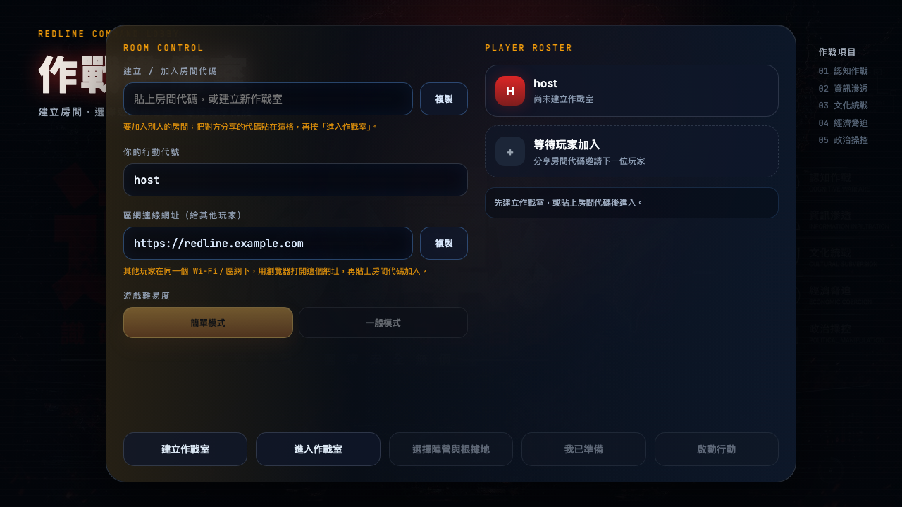

### 1.2 選擇陣營與根據地

建立或加入房間後，按「**選擇陣營與根據地**」。系統會開啟完整的選擇視窗。

左側先列出陣營大類。右側會顯示目前選項的能力、特殊規則、勝利條件與時代關卡。

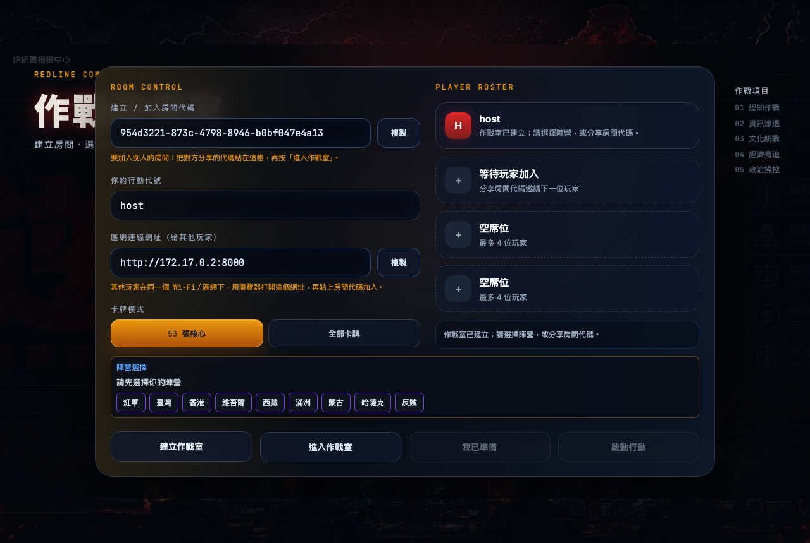

部分陣營還有路線或根據地選項。例如臺灣可以選擇綠線或藍線。請依序選擇陣營、路線與根據地，再按「**確認陣營與根據地**」。

同一個陣營與根據地不能由多位玩家重複選擇。

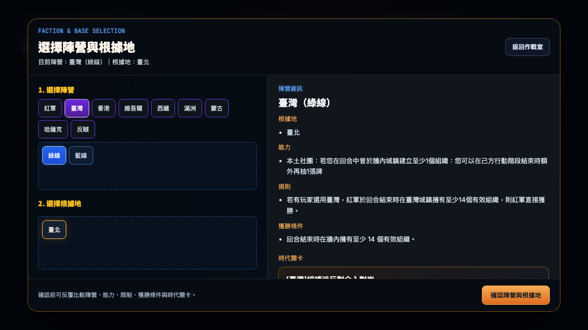

### 1.3 等待玩家並開始遊戲

「PLAYER ROSTER」會同步顯示所有玩家的陣營、根據地與準備狀態。

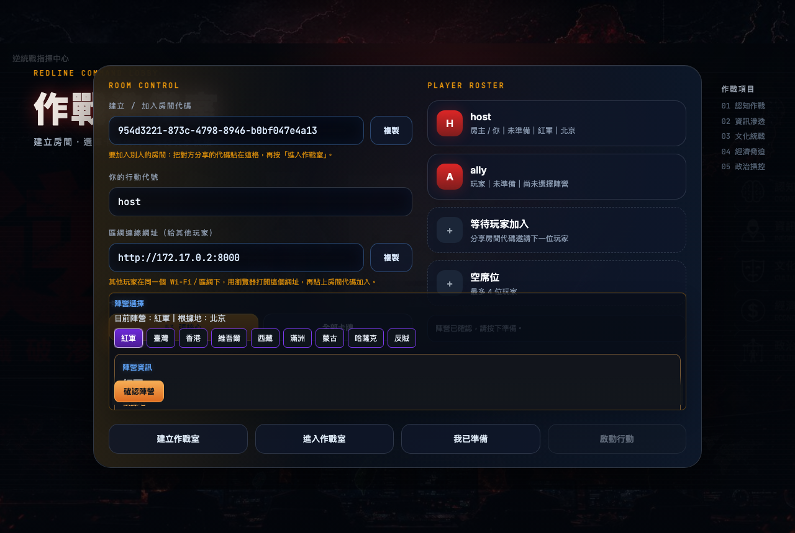

所有玩家選定陣營後，各自按「**我已準備**」。房間內必須有一名紅軍玩家。

全員準備完成後，房主可以按「**啟動行動**」。

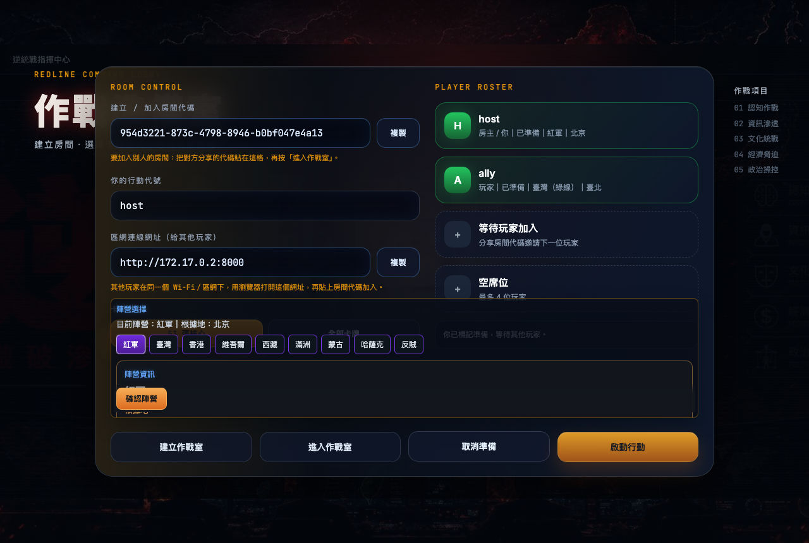

---

## 2. 遊戲畫面總覽

開局後，系統預設顯示「**指揮中心**」。目前畫面分為三個主要卡牌區域：

- **常設購買區**：固定供應的卡牌。卡牌右上角會顯示剩餘數量。
- **隨機購買區**：依目前卡牌模式抽出的購買選項。
- **手牌**：你目前持有的卡牌，以及每張卡的「資源」與「行動」按鈕。

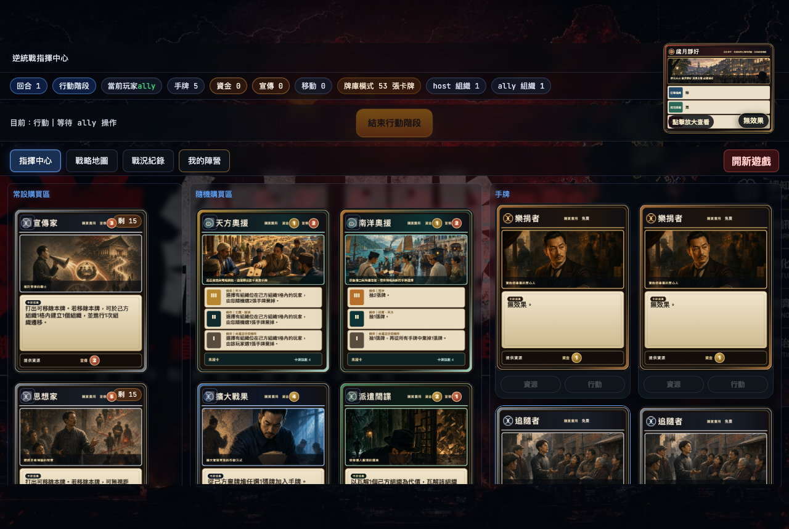

畫面最上方的 HUD 顯示：

- 回合數與當前玩家。
- 你的資金、宣傳及移動點。
- 每位玩家目前的組織數量。
- 目前階段與下一個可執行步驟。

HUD 下方是主要分頁列：

- **指揮中心**
- **戰略地圖**
- **戰況紀錄**
- **我的陣營**
- **事件卡**
- 目前生效的時代關卡分頁

「結束行動」與紅軍能力等回合控制也位於這一列的右側。

### 2.1 查看事件卡

每輪事件出現時，系統會先放大顯示事件卡。關閉後，你可以隨時按分頁列中的「**事件卡｜事件名稱**」重新查看。

事件卡會列出任務條件、成功效果、失敗效果與目前進度。

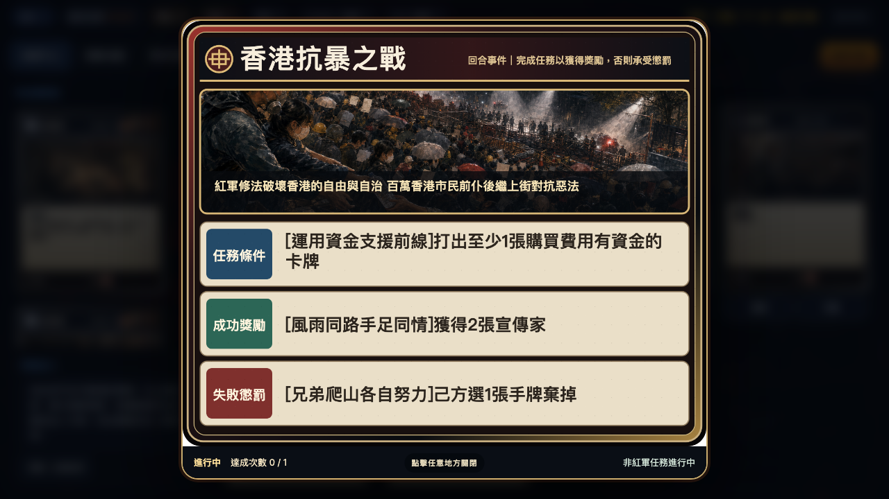

---

## 3. 行動階段

輪到你時，右上角會顯示「目前：行動」與你的操作提示。

在行動階段中，你可以自由交錯執行下列操作：

- 將手牌當作資源打出。
- 執行卡牌的行動效果。
- 購買一張或多張卡牌。
- 使用可用的陣營能力。
- 使用卡牌效果取得的移動點。

完成所有操作後，再按「**結束行動**」。

### 3.1 將卡牌當作資源

每張手牌下方都有「資源」與「行動」按鈕。

- 按「**資源**」會取得卡面列出的資金、宣傳或其他資源。
- 按「**行動**」會執行卡牌的行動效果。
- 同一張卡只能選擇其中一種用法。

卡牌結算後會離開手牌。HUD 會立即更新你的資源。

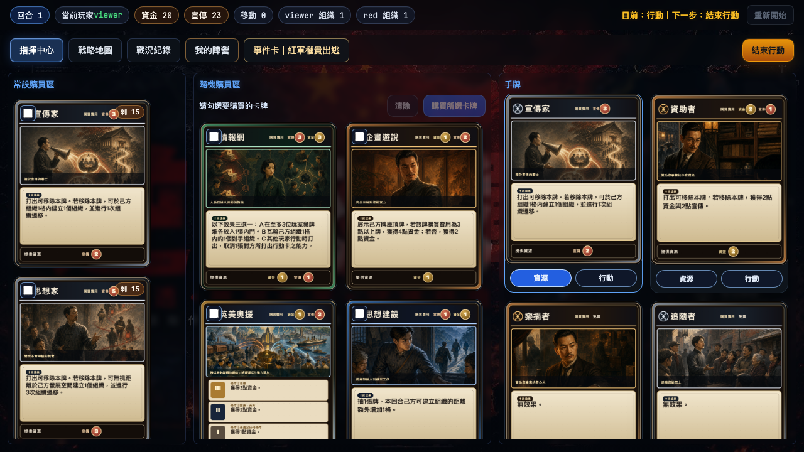

### 3.2 購買卡牌

購買區內的每張卡都有勾選框。你可以一次選擇一張或多張卡。

畫面會顯示已選張數與合計費用。資源足夠時，「**購買所選 N 張**」按鈕會啟用。

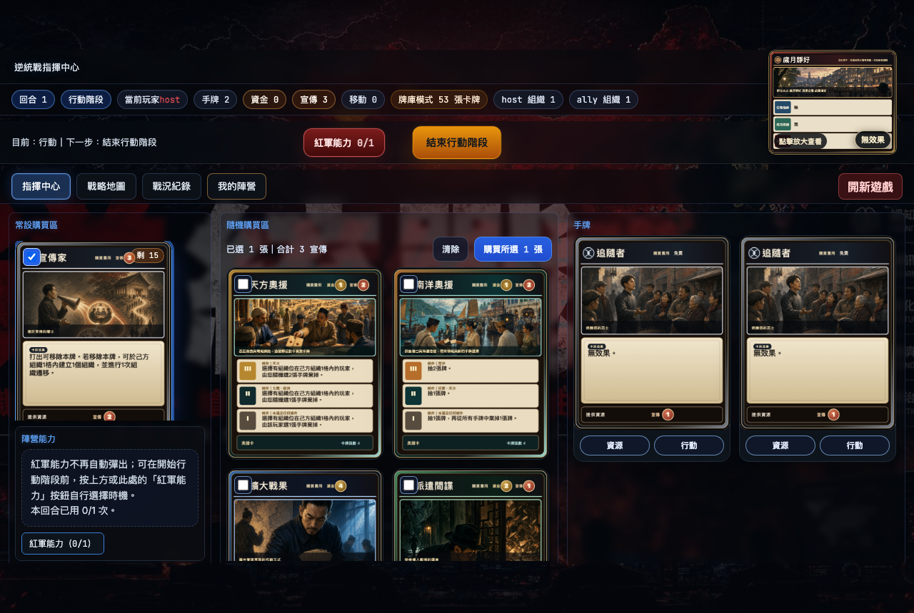

按下購買按鈕後，系統會開啟確認視窗。請確認卡牌名稱、來源區域與總費用，再按「**確定購買**」。

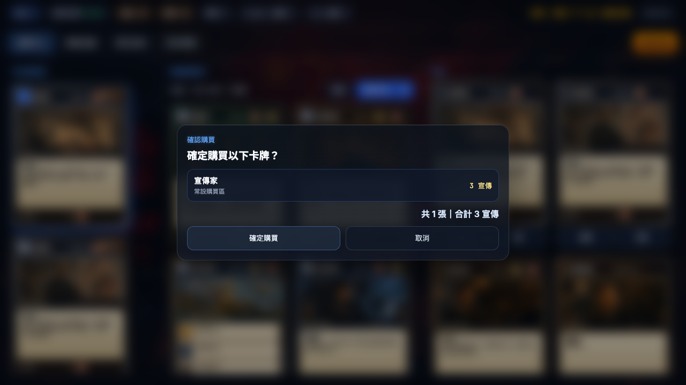

買到的卡牌會進入你的棄牌堆，不會直接進入手牌。你可以在同一個行動階段繼續出牌或購買。

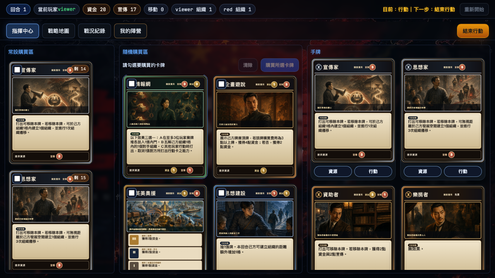

### 3.3 使用戰略地圖

按「**戰略地圖**」切換到地圖畫面。

左側是目前城鎮、地圖模式與合法操作。右側是戰略地圖。城鎮圓圈與陣營色彩會顯示組織及根據地狀態。

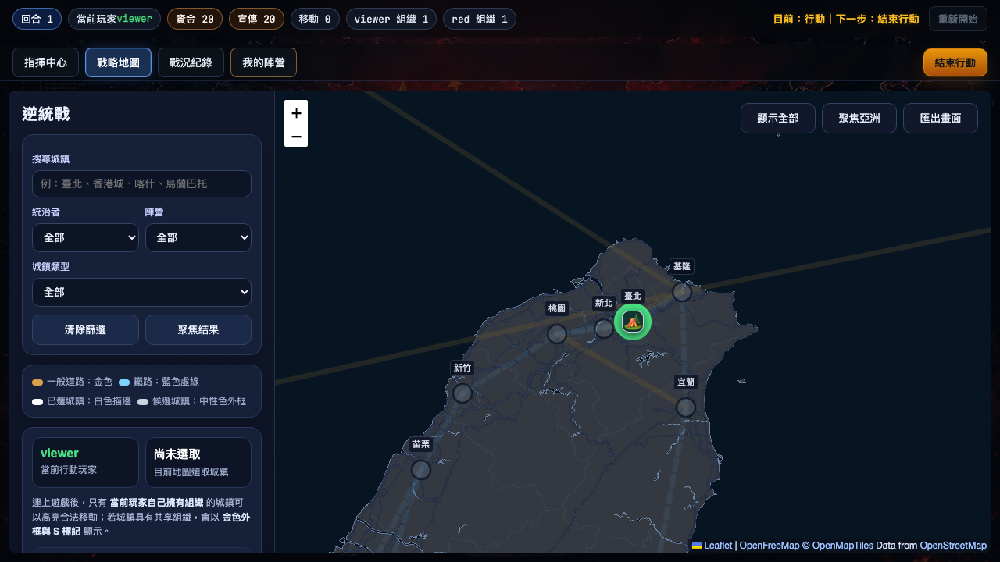

地圖使用暗色陸地、清楚海岸線與主要道路。底圖不顯示一般地名或 POI。遊戲城鎮名稱與組織標記由 REDLINE 自己顯示。

如果有玩家選擇「宛」，地圖會加入南陽與 20 個宛擴充城鎮。宛的完整勝利條件可以在「我的陣營」查看。

### 3.4 透過卡牌建立組織

打出具有建立組織效果的行動卡後，系統會自動切換到戰略地圖。合法候選城鎮會使用高對比圓圈標示。

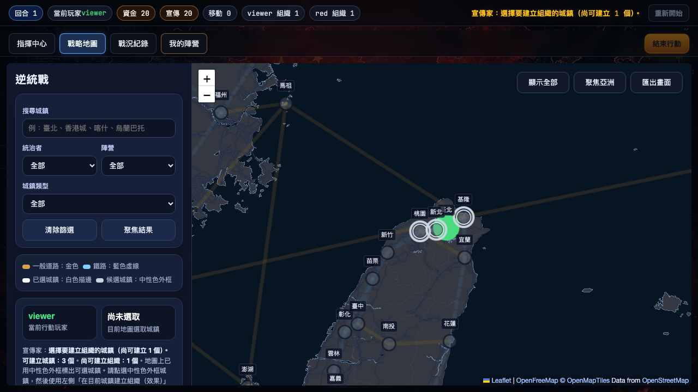

按一個候選城鎮後，左側會顯示目前選擇。確認按鈕會在操作合法時啟用。

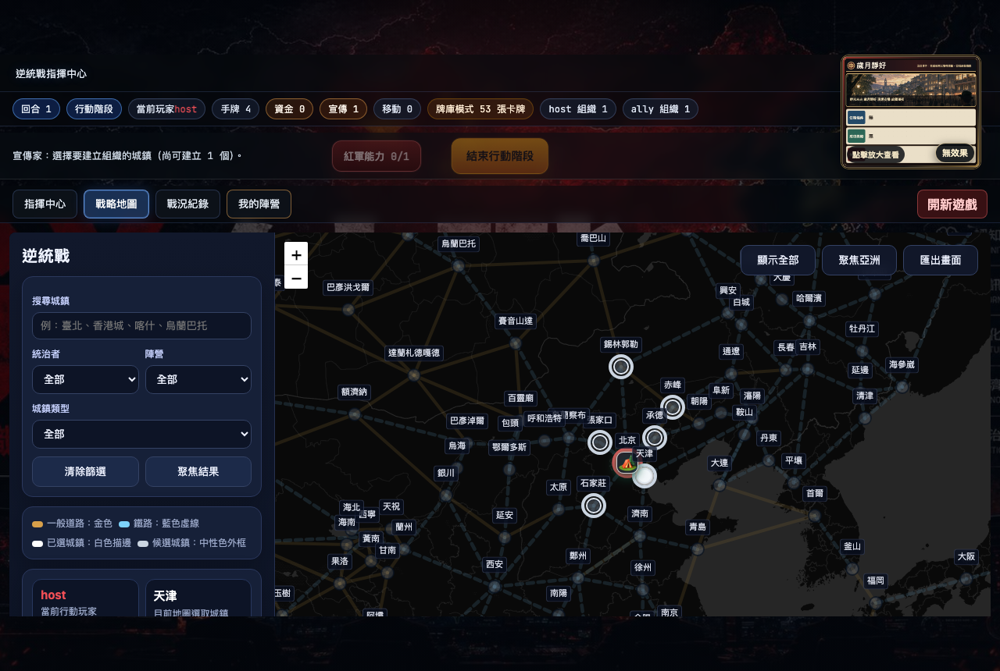

按下確認按鈕後，系統才會正式建立組織。地圖標記、玩家資訊與組織數量會同步更新。

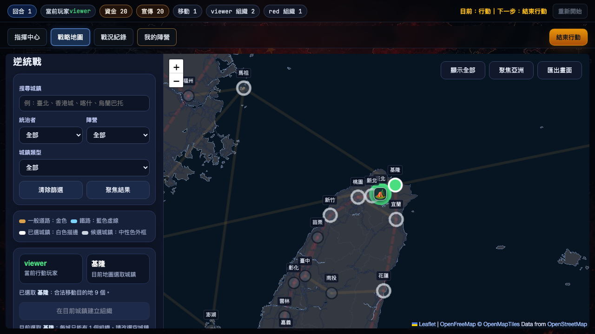

### 3.5 結束行動

完成出牌、購買與其他能力後，按右上角的「**結束行動**」。

系統會依規則處理棄牌、補牌、購買區補充、事件結算及必要選擇。全部完成後，HUD 會顯示下一位當前玩家。不是你的回合時，手牌操作按鈕會停用。

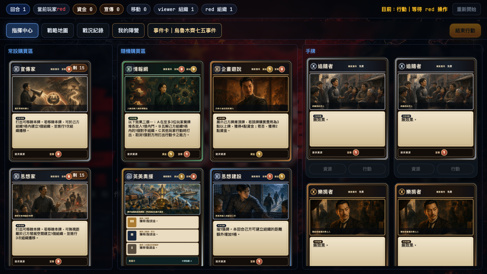

---

## 4. 陣營能力與個人資訊

### 4.1 使用陣營能力

有主動能力的陣營會在分頁列右側看到對應按鈕。

紅軍玩家可以按「**紅軍能力**」查看統戰部、政工部、國安部與中紀委。視窗會說明每個能力的效果與目前使用次數。

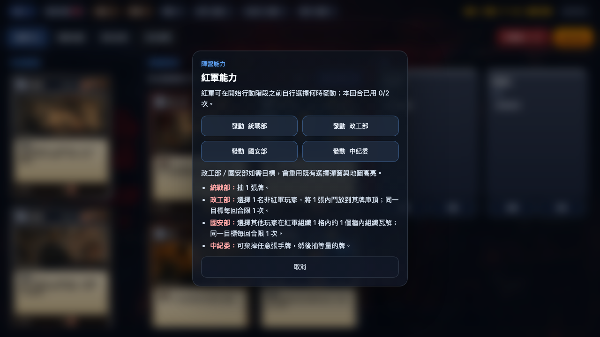

其他需要指定卡牌、玩家或城鎮的能力，也會使用中央選擇視窗或戰略地圖完成操作。

### 4.2 查看自己的陣營

按「**我的陣營**」查看目前玩家的私人參考資料。

左側會顯示根據地、能力、特殊規則與勝利條件。右側會顯示該陣營的時代關卡。按時代關卡卡面可以查看完整內容。

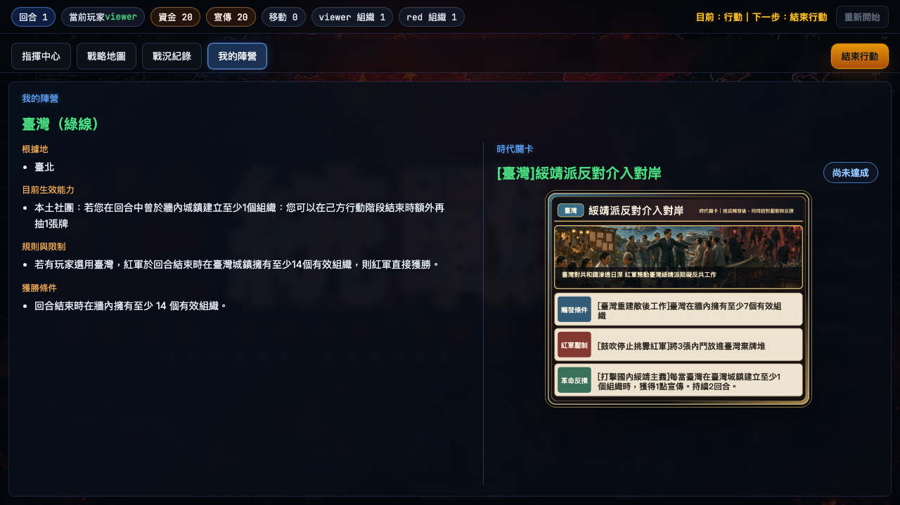

---

## 5. 戰況紀錄與公開結果

按「**戰況紀錄**」可以查看已公開的行動與結算結果。

重要的公開結果、錯誤及待選效果會使用中央提示視窗。視窗可以關閉。部分持續資訊關閉後仍可從事件卡、時代關卡或對應分頁重新開啟。

其他玩家的私人手牌內容不會顯示在你的畫面或公開紀錄中。

---

## 6. 遊戲結束

玩家達成陣營勝利條件時，遊戲會進入結算畫面。若到規定回合仍沒有反對陣營獲勝，紅軍會依規則取得生存勝利。

結算畫面會顯示：

- 主要獲勝者與共同獲勝者。
- 對應陣營的結局敘述。
- 每位玩家的最終組織、資金與宣傳統計。
- 「檢視最終盤面」按鈕。

按結局圖片可以查看完整、未裁切的勝利插畫。

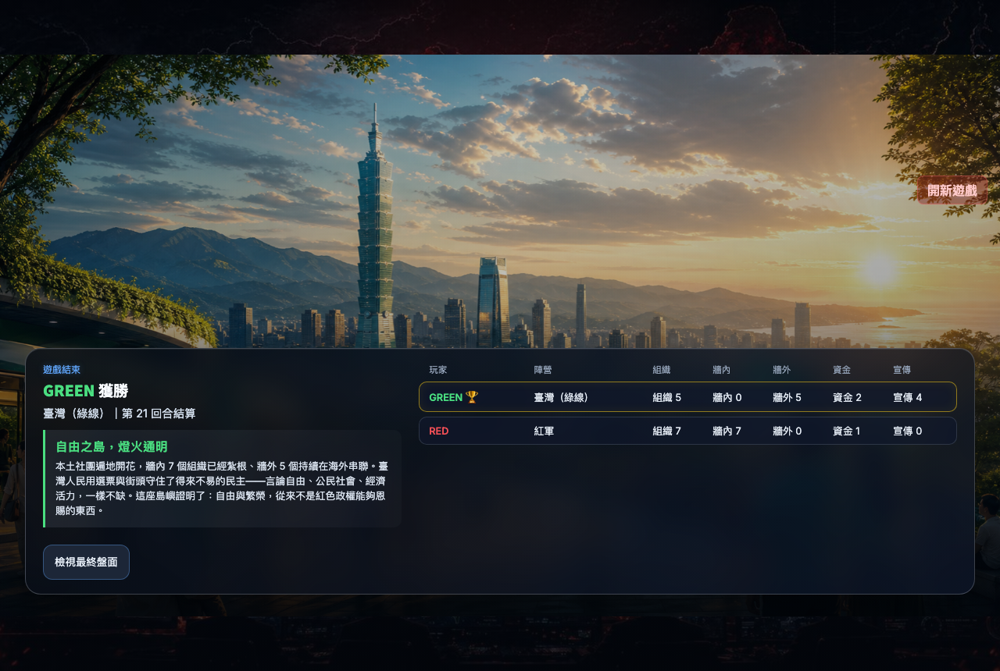

---

## 7. 快速提示

- **卡牌模式**：簡單模式使用 53 張卡牌；一般模式使用完整的 245 張卡牌。建立房間後，只有房主可以切換模式。
- **卡牌查看**：按卡面可以放大查看完整內容。按背景或關閉按鈕可以返回。
- **移動**：卡牌效果會提供移動點。移動前先在戰略地圖選擇起點與目的地，再按確認按鈕。
- **鐵路**：一次鐵路移動可以跨越最多 3 個城鎮，但仍消耗 1 點移動。
- **瓦解**：觸發瓦解效果後，地圖會用 💀 標示合法目標。選擇城鎮後仍要按確認按鈕。
- **事件與時代關卡**：關閉放大視窗後，可以從上方分頁列重新開啟。
- **戰況紀錄**：如果你不確定剛才發生了什麼，請先查看「戰況紀錄」。
- **重新開始**：右上角的「重新開始」會離開目前對局。房間與遊戲狀態只存在於目前伺服器程序中。
